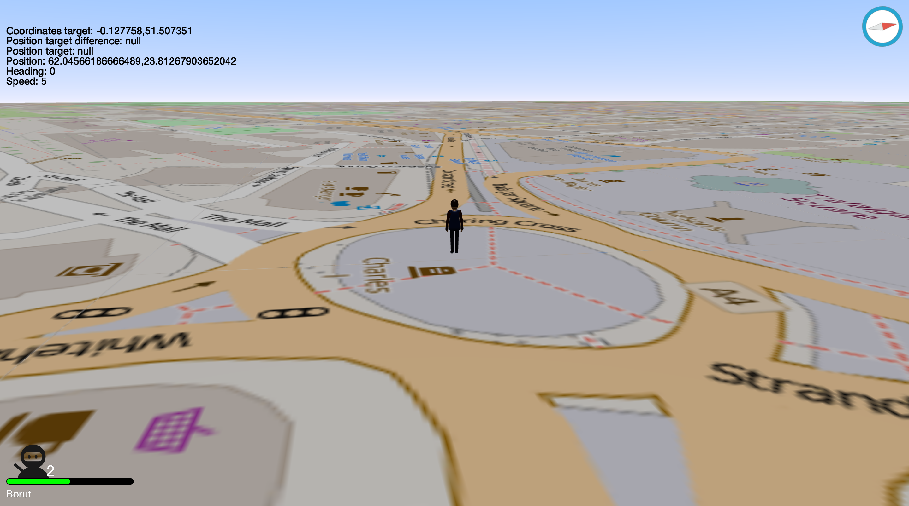
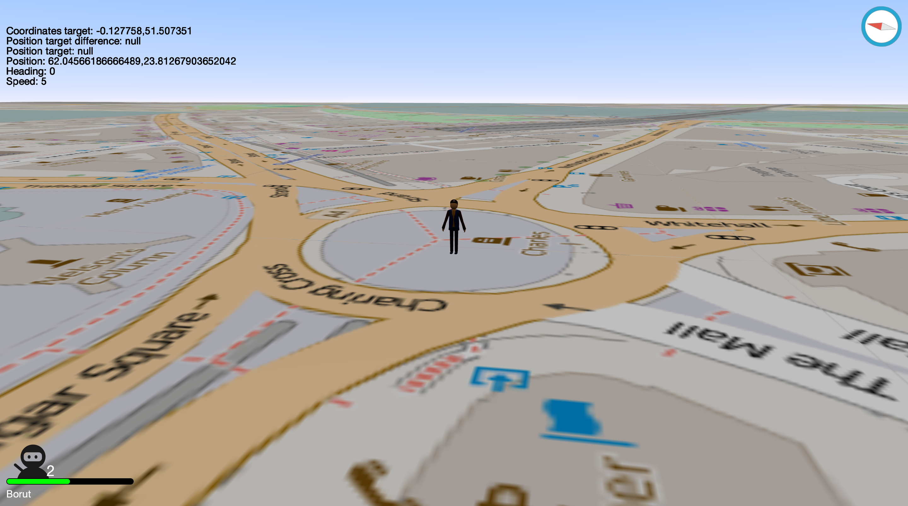

# Geolocation Game
A Geolocation game (like Pokemon Go), build with BabylonJS.

It's still at the very beginning. The model is also just temporary.

## Setup / installation
* Just run `bower install` to install the dependencies
* That's it

## To-Do
* Vector tiles
* Better documentation
* OOP JS
* Remove global variables
* Nicer preloader
* Models loading should be a part of the preloader

## Preview

## Credits
* Compass icon - https://www.iconfinder.com/icons/246006/apple_browser_compass_safari_icon#size=128
* Avatar - https://www.iconfinder.com/icons/479476/avatar_ninja_samurai_warrior_icon#size=256

## License
Geolocation Game is licensed under the MIT license.
